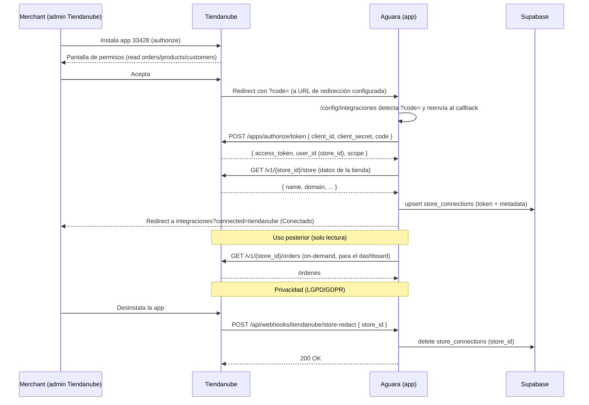

# Homologación Tiendanube — App Aguara (#33428)

Checklist completo para publicar la app en la Tienda de Aplicaciones de Tiendanube.
Basado en la documentación oficial de homologación y en los campos reales del Partner Portal.

> **Estado actual:** app "En desarrollo". Conecta OK en tiendas demo. Para instalar en
> tiendas reales de clientes hace falta homologar (o usar distribución privada — ver al final).

---

## 1. Datos de publicación (Partner Portal → app 33428 → Configuración → Datos de publicación)

| Campo | Valor recomendado | Estado |
| --- | --- | --- |
| **URL de configuraciones** | `https://aguara-control-tower-repo.vercel.app/config/integraciones` | A completar |
| **URL de política de privacidad** | `https://aguara-control-tower-repo.vercel.app/legal/privacidad` | ⚠️ Falta crear la página |
| **URL de soporte** | `https://aguara.io/soporte` (o la que uses) | ⚠️ Confirmar/crear |
| **E-mail de soporte** | `sebastian@aguara.io` | Listo para cargar |
| **Handle de la aplicación** | `aguara` | A completar |
| **Códigos externos** (FB Pixel / GA / Ads) | opcional | Opcional |

### Listing por país (mínimo Argentina) — requiere tu input
Para cada idioma/mercado (AR como mínimo) el portal pide:
- **Descripción** → redactada abajo (sección 4). ✅ lista para pegar
- **Imágenes promocionales** → ⚠️ las tenés que subir vos (capturas del dashboard, banner). No puedo generarlas.
- **Precio / modelo de cobranza** → ⚠️ decisión de negocio tuya (gratis / mensual / por uso).

---

## 2. Webhooks de privacidad (LGPD/GDPR) — IMPLEMENTADOS ✅

Antes apuntaban a `https://aguara.io` (placeholder). Implementé 3 endpoints reales que
**verifican la firma HMAC** (`x-linkedstore-hmac-sha256`, hex, firmada con el client secret)
y responden 200. Cargá estas URLs en **Datos básicos → Privacidad**:

| Campo en el portal | URL |
| --- | --- |
| URL webhook **store redact** | `https://aguara-control-tower-repo.vercel.app/api/webhooks/tiendanube/store-redact` |
| URL webhook **customers redact** | `https://aguara-control-tower-repo.vercel.app/api/webhooks/tiendanube/customers-redact` |
| URL webhook **customers data request** | `https://aguara-control-tower-repo.vercel.app/api/webhooks/tiendanube/data-request` |

Comportamiento implementado (Aguara es un dashboard de métricas: no persiste PII de clientes,
lee las órdenes vía API on-demand y solo guarda el token de conexión):
- **store/redact** → borra la conexión (token + datos de la tienda) de `store_connections`.
- **customers/redact** → verifica firma, audita en logs y confirma (no hay PII de clientes guardada que borrar).
- **customers/data_request** → verifica firma, audita en logs y confirma (no hay PII que reportar).

> Pendiente de deploy: estos endpoints están en el código pero hay que pushear/deployar (ver sección 6).

---

## 3. Requisitos de homologación (artefactos que pide Tiendanube al solicitar la revisión)

Según la doc oficial (`dev.tiendanube.com/docs/homologation/requirements`), al pedir homologación
el equipo de Tiendanube pide:

1. **Diagrama de secuencia** del flujo (OAuth + webhooks + uso de la API). → incluido en sección 5. ✅
2. **Video demo** que muestre (⚠️ lo tenés que grabar vos):
   - Instalación **desde Tiendanube** usando `https://www.tiendanube.com/apps/33428/authorize` (no desde el panel de la app).
   - Registro de un usuario nuevo + login de un usuario existente.
   - Reinstalación (desinstalar y volver a instalar).
   - Todos los flujos del diagrama de secuencia (permisos, sincronización).
   - Uso de la app y sus funcionalidades principales.
3. **Cuenta demo ya liberada** (sin pasos de suscripción/pago que frenen la validación). → ya tenés "Aguara Test".
4. **NubeSDK** (vigente desde 5-jun-2026): obligatorio **para apps que corren dentro del storefront/checkout/admin de Tiendanube**. ⚠️ **Aguara es una app externa/standalone** (dashboard propio, OAuth estándar), por lo que en principio **NO aplica**. Confirmar este punto con Gonzalo para evitar un rechazo por interpretación.

---

## 4. Contenido del listing (redactado — listo para pegar)

**Nombre:** Aguara — Business Control Tower

**Descripción corta (1 línea):**
> Centralizá ventas, costos y rentabilidad de tu tienda en un solo panel, con ROAS y CPA reales.

**Descripción larga:**
> Aguara es tu centro de control de negocio. Conectá tu tienda Tiendanube y mirá en un solo
> dashboard tus órdenes, facturación, ticket promedio, ganancia y márgenes en tiempo real —
> sin planillas ni cálculos manuales.
>
> Cruzá tus ventas con la inversión publicitaria de Meta Ads y Google Ads para ver tu **ROAS y
> CPA reales**, y entendé de verdad qué campañas te dejan rentabilidad. Sumá costos de productos,
> envíos, comisiones e impuestos para conocer tu **ganancia neta**, no solo la facturación.
>
> Pensado para dueños de e-commerce y equipos de marketing que quieren tomar decisiones con datos
> claros. Solo lectura: Aguara nunca modifica tu tienda, tus productos ni tus órdenes.
>
> **Funcionalidades:**
> - Dashboard de ventas y rentabilidad en tiempo real
> - ROAS y CPA reales (ventas cruzadas con inversión en ads)
> - Ganancia neta con costos, envíos, comisiones e impuestos
> - Métricas por producto e inventario
> - Alertas y snapshots diarios

**Permisos solicitados (solo lectura):** órdenes, productos, clientes.

---

## 5. Diagrama de secuencia (artefacto requerido)

Flujo de instalación + OAuth + webhooks (renderizable en cualquier visor Mermaid):



---

## 6. Pendiente de deploy (código)

Estos cambios ya están en el repo pero hay que pushear/deployar a Vercel:
- `src/lib/tiendanube-webhook.ts` (verificación HMAC + service client)
- `src/app/api/webhooks/tiendanube/store-redact/route.ts`
- `src/app/api/webhooks/tiendanube/customers-redact/route.ts`
- `src/app/api/webhooks/tiendanube/data-request/route.ts`

```
git add src/lib/tiendanube-webhook.ts src/app/api/webhooks/tiendanube
git commit -m "feat(tiendanube): mandatory privacy webhooks (store/customers redact + data request)"
git push
```

Falta también (si vamos por homologación pública): crear la **página de política de privacidad**
(`/legal/privacidad`) para tener la URL del listing. Te la puedo armar cuando digas.

---

## 7. Resumen: qué falta y de quién depende

| Item | Responsable |
| --- | --- |
| Webhooks de privacidad (código) | ✅ Hecho — falta deploy |
| Cargar las 3 URLs de webhooks en el portal | Vos (o yo, en el portal) |
| Descripciones del listing | ✅ Redactadas |
| Cargar campos de "Datos de publicación" (URLs, handle, email) | Vos / yo en el portal |
| Página de política de privacidad | Yo (cuando lo pidas) |
| Imágenes promocionales | ⚠️ Vos (assets de marca) |
| Precio / modelo de cobranza | ⚠️ Vos (decisión de negocio) |
| Video demo de la app | ⚠️ Vos (grabación) |
| Diagrama de secuencia | ✅ Hecho (sección 5) |
| Confirmar si NubeSDK aplica a app externa | Vos con Gonzalo |
| Cuenta demo liberada | ✅ Aguara Test |
